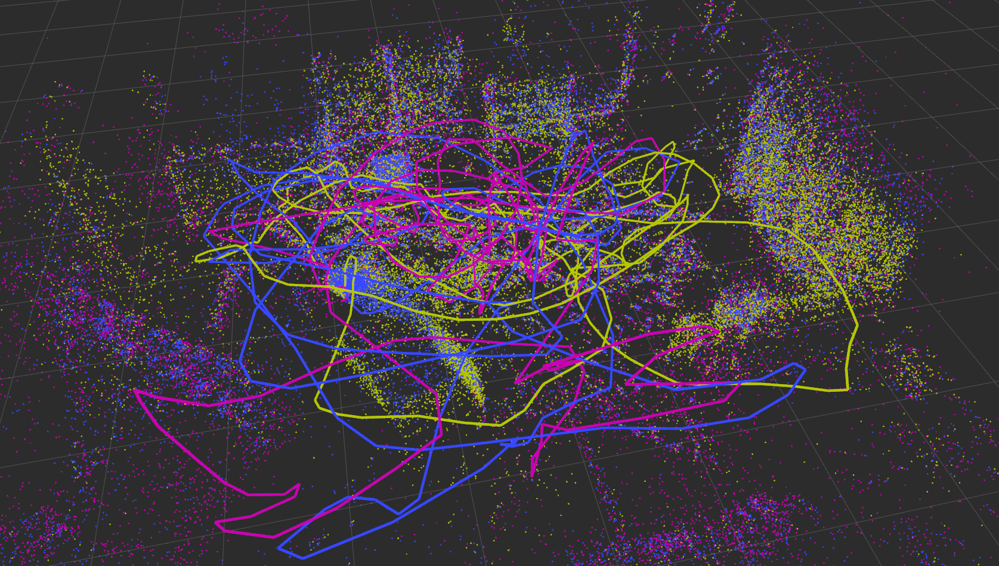
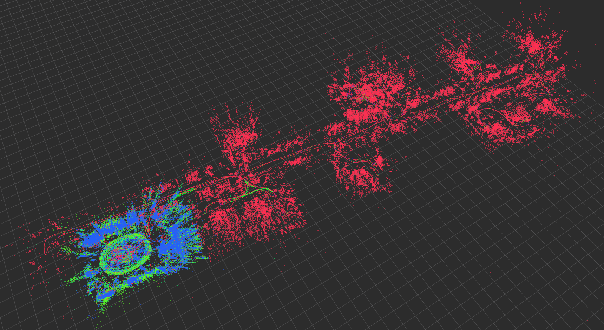
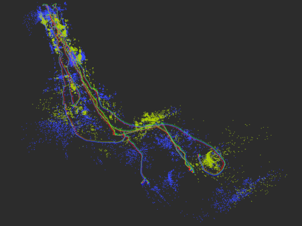
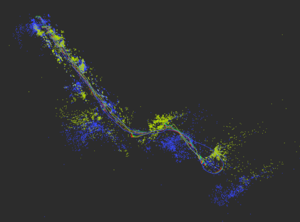

# OpenVINS Maplab Interface

[](https://github.com/rpng/ov_maplab/actions/workflows/build_ros1.yml)

Here we have our interface wrapper for exporting visual-inertial runs from [OpenVINS](https://github.com/rpng/open_vins) into the ViMap structure taken by [maplab](https://github.com/ethz-asl/maplab). The state estimates and raw images are appended to the ViMap as OpenVINS runs through a dataset. After completion of the dataset, we re-extract features and triangulate them due to the incompatibilities of the two frontends. Maplab requires BRISK or FREAK descriptors, while OpenVINS works with KLT or ORB feature tracking. In the future we will try to only extract descriptors on tracked features from OpenVINS, but for now we just re-detect for simplicity. We have tested this on the [EurocMav](https://docs.openvins.com/gs-datasets.html#gs-data-euroc) and [TUM-VI](https://docs.openvins.com/gs-datasets.html#gs-data-tumvi) datasets and have had good success with merging the different runs and optimizing the resulting graph. To ensure that we are able to compile maplab, we provide a [docker image](Dockerfile) for Ubuntu 18.04 which has all dependencies required.

## Dependencies

* OpenVINS (v2.7 release) - https://docs.openvins.com/gs-installing.html
* maplab (develop v2, 20.04 release) - https://github.com/ethz-asl/maplab/wiki/Installation-Ubuntu
* Docker - https://docs.docker.com/get-docker/

## Installation Guide

Clone and setup workspace:
```bash
# setup our workspace and clone
mkdir -p catkin_ws_maplab/src/
cd catkin_ws_maplab/src/
git clone https://github.com/rpng/ov_maplab.git
git clone https://github.com/rpng/open_vins.git
git clone https://github.com/ethz-asl/maplab.git --recursive
# switch open_vins to last tested commit (might build with newer)
cd open_vins/
git checkout 4534a2f32d4763bdc8c95121b3292c7423e12aca
cd ..
# switch maplab to last tested commit (might build with newer)
cd maplab/
git checkout 0b4868efeb292851d71f98d31a1e6bb40ebb244b
git submodule update --init --recursive
cd ..
```

Build the docker image:
```bash
cd ov_maplab/
docker build -t ov_maplab .
nano ~/.bashrc
xhost + &> /dev/null
export DOCKER_CATKINWS=/home/username/workspace/catkin_ws_maplab
export DOCKER_DATASETS=/home/username/datasets
alias ov_docker="docker run -it --net=host --gpus all \
    --env=\"NVIDIA_DRIVER_CAPABILITIES=all\" --env=\"DISPLAY\" \
    --env=\"QT_X11_NO_MITSHM=1\" --volume=\"/tmp/.X11-unix:/tmp/.X11-unix:rw\" \
    --mount type=bind,source=$DOCKER_CATKINWS,target=/catkin_ws \
    --mount type=bind,source=$DOCKER_DATASETS,target=/datasets $1"
source ~/.bashrc
cd ..
```

Build maplab, OpenVINS, and ov_maplab in the container:
```bash
ov_docker ov_maplab bash
cd catkin_ws/
catkin init
catkin config --merge-devel
catkin config --extend /opt/ros/noetic
catkin config --cmake-args -DCMAKE_BUILD_TYPE=Release
catkin build maplab ov_maplab -j4
catkin build ov_maplab -j4 --no-deps # after first build
source devel/setup.bash
```


## Processing Map Example

Load into docker bash shell and run OpenVINS:
```bash
ov_docker ov_maplab bash
cd catkin_ws/
source devel/setup.bash
# run OpenVINS on a dataset
roslaunch ov_maplab serial.launch config:=euroc_mav dataset:=V1_02_medium
```

Load and process the generated map:
```bash
# load into the main console
rosrun maplab_console maplab_console
# load all our maps and join them (they should each be a mission)
load_all --maps_folder /datasets/euroc_mav/maplab/
join_all_maps --target_map_key mergedmap
set_mission_baseframe_to_known
# Display all the loaded missions
map_stats
# (optional) Retriangulate landmarks and remove bad ones
retriangulate_landmarks
remove_bad_landmarks
# Visualize all missions with different colors
spatially_distribute_missions
v --vis_color_by_mission
# anchor all frames to the first mission
anchor_all_missions
print_baseframes
# Loop close the map.
loopclosure_all_missions
# Pose graph relaxation
relax
# (optional) Key-frame the map (needed to reduce memory requirements)
keyframe_heuristic
# Visualize all missions with different colors
v --vis_color_by_mission
# Bundle adjustment.
optimize_visual_inertial --ba_num_iterations=50 --ba_visualize_every_n_iterations=1
# Save the final map (overwrite the old map if there is one)
save --overwrite --map_folder <your_new_merged_map_folder_path>
```

## Leveraging Maplab as Groundtruth

A use case is if one wishes to use maplab optimized and loop-closed trajectory as groundtruth for evaluation on datasets which do not have an external pose system (i.e. no vicon available). For example of the V1\_01\_easy eurocmav dataset before optimization the RMSE was 0.680 degrees and 0.055 meters. After performing loop closure and optimizing the RMSE was 0.576 degrees and 0.021 meters as compared to the published groundtruth. Here are a few example commands which we use to process a run on the eurocmav dataset and then optimize it to be used as a groundtruth.


Load into docker bash shell and run OpenVINS:
```bash
# load into docker bash
ov_docker ov_maplab bash
cd catkin_ws/
source devel/setup.bash
# run openvins and export the map
roslaunch ov_maplab serial.launch config:=euroc_mav dataset:=V1_02_medium
```


Process and export an optimized map:
```bash
# load the map into maplab
rosrun maplab_console maplab_console
load --map_folder /datasets/euroc_mav/maplab/V1_02_medium/
# optimize the map
retriangulate_landmarks
remove_bad_landmarks
set_mission_baseframe_to_known
loopclosure_all_missions
relax
visualize
optimize_visual_inertial --ba_num_iterations=25 --ba_visualize_every_n_iterations=1
# finally, we can export using our custom utility
# this will get it into our space separated format needed for ov_eval
export_to_openvins --export_path /datasets/euroc_mav/maplab/
```


## Example Merges

Example map merging of the V1_01_easy, V1_02_medium, and V1_03_difficult from the EurocMav datasets:


Example map merging of the room1, room2, room3, and corridor1 from the TUM-VI datasets:


Example map merging of the aruco_hallway_02 and aruco_hallway_02 from the RPNG aruco datasets (before left and after right):

  


